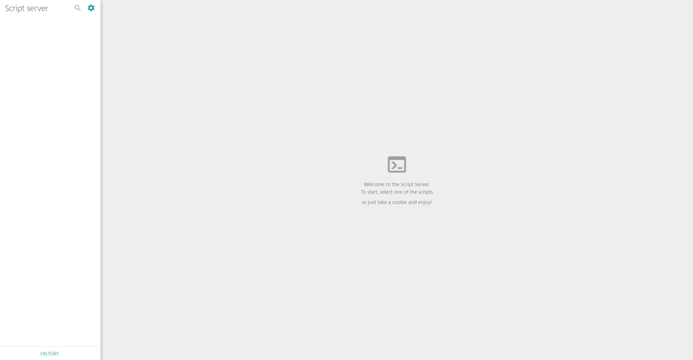

# docker-script-server

[](https://drone.docker-for-life.de/alcapone1933/docker-script-server)
[](https://drone.docker-for-life.de/alcapone1933/docker-script-server/branches)
[](https://hub.docker.com/r/alcapone1933/script-server/tags)


&nbsp;

### FORK
Docker script-server the original is from github \
https://github.com/bugy/script-server

### Docker REPO
https://hub.docker.com/r/alcapone1933/script-server

* * *

Script-server is a Web UI for scripts.

As an administrator, you add your existing scripts into Script server and other users would be able to execute them via a web interface. The UI is very straightforward and can be used by non-tech people.

No script modifications are needed - you configure each script in Script server and it creates the corresponding UI with parameters and takes care of validation, execution, etc.

&nbsp;

[DEMO server](https://script-server.net/) \
BY https://github.com/bugy/script-server

[Admin interface screenshots](https://github.com/bugy/script-server/wiki/Admin-interface) \
BY https://github.com/bugy/script-server

## WIKI

BY bugy/script-server https://github.com/bugy/script-server/wiki

[](https://script-server.net/)

&nbsp;

## Usage

### Setup and run
1. Create configurations for your scripts in *conf/runners/* folder (see [script config page](https://github.com/bugy/script-server/wiki/Script-config) for details)
2. Docker start 
3. Add/edit scripts on the admin page

By default, the server will run on http://localhost:5000

### Server config
All the features listed above and some other minor features can be configured in *conf/conf.json* file. 
It is allowed not to create this file. In this case, default values will be used.
See [server config page](https://github.com/bugy/script-server/wiki/Server-configuration) for details

### Admin panel
Admin panel is accessible on admin.html page (e.g. http://localhost:5000/admin.html)

## Logging

All web/operating logs are written to the *logs/server.log*
Additionally each script logs are written to separate file in *logs/processes*. File name format is
{script\_name}\_{client\_address}\_{date}\_{time}.log.

### Docker CLI

```bash
docker run -d \
    -p 5000:5000 \
    -e TZ=Europe/Berlin \    
    -v script-server_data:/app/ \
    --restart always \
    --name script-server \
    alcapone1933/script-server:latest
```

### Docker Compose

```yaml
version: "3.9"
services:
  script-server:
    image: alcapone1933/script-server:latest
    container_name: script-server
    restart: always
    ports:
      - 5000:5000
    environment:
      - TZ=Europe/Berlin
    volumes:
      data:/app/
      # - ./app/conf.json:/app/conf/conf.json

volumes:
  data:
```

* * *

## Ports

| Name        | Value   | Example    |
| ----------- | ------- | ---------- |
| Web Port    | 5000    | 5000:5000  |

* * *

## Volume params

| Name    | Value   | Example                   |
| ------- | ------- | ------------------------- |
| Data    | volume  | script-server_data:/app/  |

* * *

## Env params

| Name          | Value     | Example                        |
| ------------- | --------- | ------------------------------ |
| Timezone      | TZ        | Europe/Berlin                  |
